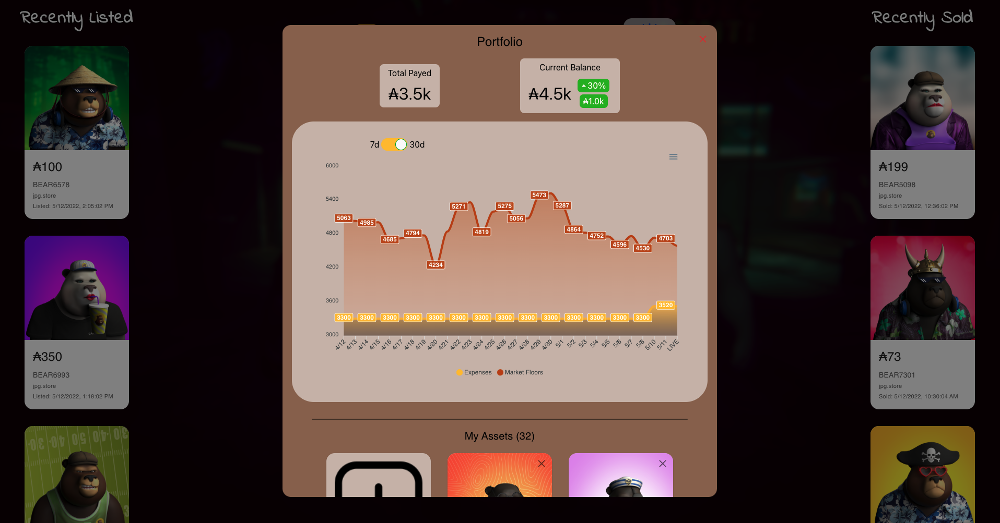

# OGBears CNFT Spy

This application is a free-to-use community tool for OGBears (Cardano NFT)! 
It is capable of following features:

1. See recently listed and recently sold Bears from [cnft.io](https://cnft.io) and [jpg.store](https://jpg.store), can be useful for "sniping" and locating trends.
2. Track "floor" prices for each Bear type through visualized data charts. Toggle between 7 days, and 30 days charts.
3. Create a portfolio where you can track gain/loss on your Bears, compared to floor prices.

## Access AWS virtual machine

1. You need to obtain a private key (`.pem` file)
2. Access the VM via SSH: `ssh -i "${FILE_NAME}.pem" ubuntu@ec2-3-22-57-176.us-east-2.compute.amazonaws.com`
3. If you need to clone the repo again for some reason, make sure to apply your GitHub token so the bot can read and write data: `git clone https://${GITHUB_TOKEN}@github.com/belferink1996/og-bears-cnft-spy.git`
4. Run `cd ./og-bears-cnft-spy`
5. Run `npm run floor-bot`

